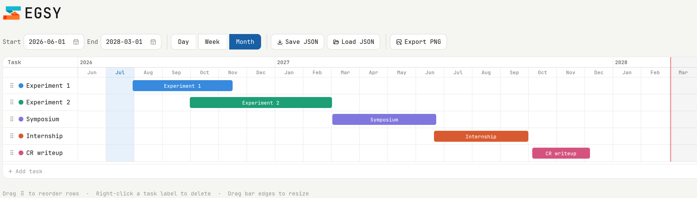

<p align="center" style="margin-bottom: 0;">
  
</p>

## Overview

Segsy is a lightweight, interactive Gantt chart editor that runs entirely in the browser.

Many Gantt chart applications are overly complex and impractical for quickly creating simple project plans.
Rejoice! Now there is _Simple Elegant Gantt Solution for You 9000 Ultra Professional Platinum Edition Deluxe (SEGSY 9000 UPPED),_ or simply _SEGSY_.

Create clean, readable Gantt charts with minimal effort.



## Features

- **Drag to move** — grab any bar and slide it left or right along the timeline
- **Drag to resize** — pull the left or right edge of a bar to change its start or end date
- **Drag to reorder** — use the grip handle on the left to drag rows up or down
- **Rename tasks** — click any task name to edit it inline
- **Delete tasks** — right-click a task label and confirm
- **Color picker** — click the color dot next to a task name to change its color
- **Zoom** — select either the day, week or month view
- **Export as a PNG** — save your Gantt charts as PNG
- **Save/Load** — save and share chart as JSON
- **Dark mode** — automatically follows your system preference
- **Certified Y2K compliant**

### Saving & sharing

| Action | How |
| --- | --- |
| **Auto-save** | Every change is silently saved to your browser's local storage. Closing and reopening the tab restores your work automatically. |
| **Save JSON** | Downloads a `gantt.json` file you can share with others. |
| **Load JSON** | Loads a previously saved `gantt.json` file, restoring the chart exactly. |
| **Export PNG** | Downloads a high-resolution PNG. |

Saved charts are plain JSON, making them easy to read, edit by hand, or track in Git. I assume at least one person, possibly three, will appreciate this.

```json
{
  "version": 1,
  "baseDate": "2026-06-01",
  "days": 30,
  "cellW": 28,
  "tasks": [
    { "id": 1, "name": "Research", "start": 0, "dur": 5, "color": "#378ADD" },
    { "id": 2, "name": "Internship","start": 5, "dur": 7, "color": "#1D9E75" },
    { "id": 3, "name": "Write up", "start": 10, "dur": 14, "color": "#7F77DD" }
  ]
}
```

`start` and `dur` are in days relative to `baseDate`.

## Limitations

- No milestones
- No collaborative editing
- No task dependencies (yet)

## Already adopted by (or likely soon-to-be adopted by)

- SpaceX (Planning Division)
- Procter & Gamble
- The Government of Paraguay
- The Czech Institute of Paleontology and Botany
- Michel from Bordeaux
- Some Microsoft employees (as an alternative to _Microsoft Project_)
- An unnamed foreign intelligence service we are not at liberty to identify
- ...and more

Please open a PR if you would like your company to be included in this list.

## License

MIT — do whatever you like with it.
